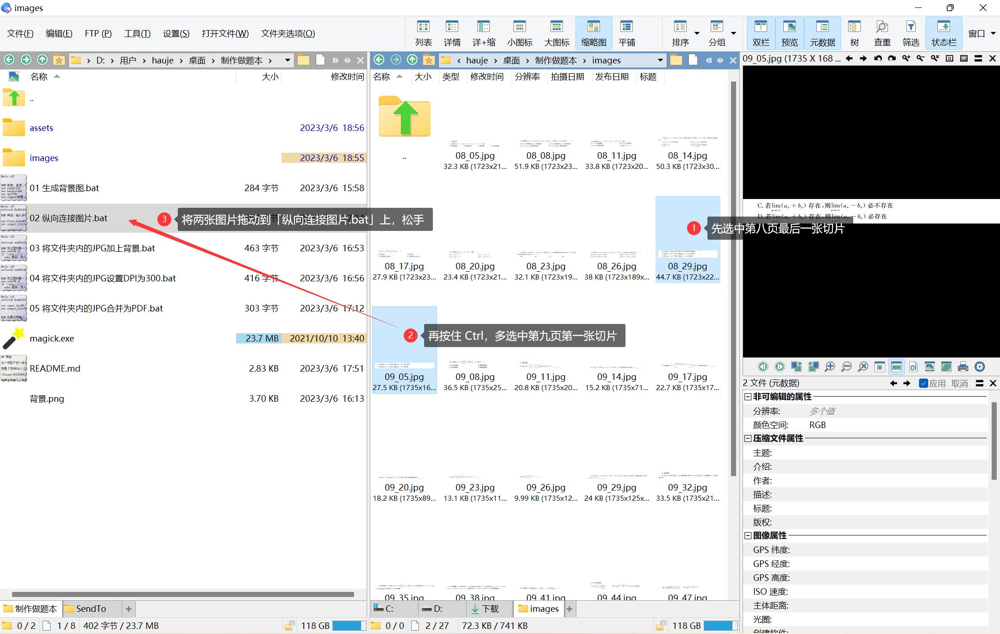

## 用途

这个项目下的一系列脚本，用于创建考研习题做题本。

像是「李林660」这样的习题册，题与题之间没有空隙，做题体验、笔记体验非常不好。

有博主就做了「做题本」，大致就是先将习题册扫描，再把每道题截图，放到一个单独的页面中，一页纸就放一道题，然后合并成PDF。

不过，博主在制作的时候好像没有去关注 pdf 的尺寸，页面放得很大，导致将这些习题册PDF导入到 GoodNotes 这样的笔记软件中时，会使得正常的笔画很细。

于是，就自己搞了一下做题本的制作流程，这样，能按照自己的喜好快速制作这样的「做题本」：

## 运行环境

只适用于 Windows

需要用到 ImageMagick，已内置 `magick.exe` 

## 用法

视频教程：[制作考研做题本，给紧凑的习题册PDF增加做题空隙](https://www.bilibili.com/video/BV13N411c7yx)

### 获取 PDF

在这里，我用「李林880」作为示例。

首先，要得到试题册的扫描版 PDF：

- 有的考研博主会提供
- 也可以到淘宝上购买扫描服务，大概是1毛一页

注意，PDF 的页面尺寸一定要正常，有的博主提供的PDF就非常大，导入笔记软件就会让正常笔画非常细。

### 题目切片

用 PhotoShop 打开 PDF，例如打开第8、9页：

通过左下角的信息，注意到页面的宽度约 17 厘米，高度约 25.6 厘米，DPI 是 300，这就是正常的一比一扫描件大小。

以第 8 页为例，用参考线工具，为每一道题做切片：

导出第 8 页的切片：

以相同的方法，为第9页制作切片、导出切片：

### 合并跨页题

注意到，第 8 页的最后一道题，只印了一半，另一半在第9页上，于是就需要将这两个切片合并起来：

### 添加背景，合并为 PDF

## 注意点

如果你的扫描版电子书的 DPI 不是300，可能需要手动改一下 bat 脚本，更改为你 PDF 对应的 DPI。

当然，你也可以用 PS 一类的工具制作更好看的背景图片。

## ChatGPT 对话大致记录

这个项目所用到的脚本，都是在 ChatGPT 的帮助下，写出来的。这是一些对话的记录：

> 接下来我会让你写一些 bat 脚本，其中会用到一些工具，如 FFmpeg、ImageMagick 等，这些工具我已安装，添加到了环境目录，可以直接使用。
>
> 写一个 bat 脚本，它会使用 ImageMagick 生成一张图片，图片的大小是 148mm * 210mm，图片的 DPI 是 300，图片的背景色是白色，色彩模式使用 RGB，输出的文件名是「背景.png」
>
> 写一个BAT脚本，它会把传入的多张 jpg 图片用 ImageMagick 的 -append 选项纵向拼接起来，输出文件直接覆盖第一个文件，最后，把第一个以外的其他文件全部删除。
>
> 在当前目录已经有一个背景图片，文件名是「背景.png」。请写一个BAT脚本，给它输入一个文件夹后，它会用 ImageMagick 递归地修改文件夹里的每一张 jpg 图片。具体修改的做法是，将传入的图片作为前景，叠加到背景图上，起点位置为 (100, 100)，单位为像素。输出的时候，直接替代原文件即可。
>
> 写一个BAT脚本，它会把传入的所有 jpg 图片用 ImageMagick 的将 DPI 修改为 300，输出的时候，直接替代原文件即可。
>
> 写一个BAT脚本，它会把传入的所有 jpg 图片用 ImageMagick 合并为一个 pdf 文件，输出到当前位置。